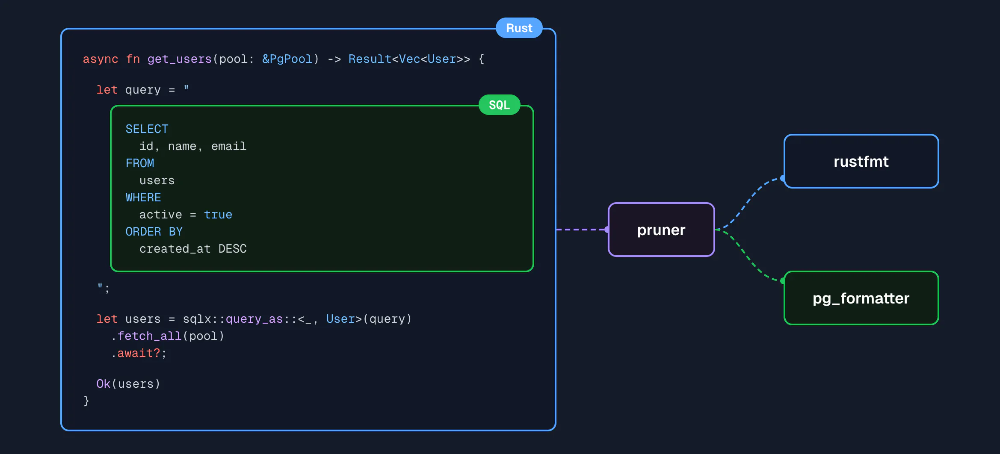

# Introduction

Pruner is a language and editor agnostic formatter which allows encapsulating all the formatting rules of your project
behind a shared, re-usable piece of config. It is designed in such a way as to allow leveraging all the existing,
language-specific formatter tools you are already using while also adding additional formatting capabilities.

Often times real-world source code contains multiple embedded languages, while formatters are typically very
language-specific and only operate on the root document - treating these embedded language regions as opaque strings.
Pruner uses Tree-Sitter to parse and understand source code files containing embedded languages, and can format those
embedded regions using their native formatting toolchain.



This effectively allows you to utilize a languages' native ecosystem for formatting across language barriers. This would
be in contrast to, for example, trying to build a single formatter which knows how to format all languages - an
impractical goal.

The goal is not to re-implement individual formatters for each language, but rather to define how to compose, configure,
and execute them.

In addition to being able to call out to existing language formatters, Pruner can also be extended using WASM-compiled
plugins. This allows encapsulating project/organization specific formatting rules, or writing brand new language
formatters in any language that can compile to WASM.

## How to use it

Pruner reads from stdin and writes to stdout.

```bash
cat hello.md | pruner format --lang markdown > hello.md
```

Run `--help` for more information, or head to the **[Quick Start](./quickstart)** to get up-to-speed.

## Acknowledgements

Thanks to [stevearc/conform.nvim](https://github.com/stevearc/conform.nvim/) For being a large driving inspiration
behind Pruners config and approach to formatter composition.
